# Flower Image Classifier

## Table of Contents
- [Project Overview](#project-overview)
- [Features](#features)
- [Project Structure](#project-structure)
- [Installation](#installation)
- [Training Workflow](#training-workflow)
  - [1. Initial Setup](#1-initial-setup)
  - [2. Dataset Management](#2-dataset-management)
  - [3. Model Configuration](#3-model-configuration)
  - [4. Training Process](#4-training-process)
  - [5. Model Evaluation](#5-model-evaluation)
- [Prediction Workflow](#prediction-workflow)
  - [1. Model Loading](#1-model-loading)
  - [2. Image Processing](#2-image-processing)
  - [3. Making Predictions](#3-making-predictions)

## Project Overview
This project implements a terminal-based pipeline for training, evaluating, and making predictions on the [102 Category Flower Dataset](https://www.robots.ox.ac.uk/~vgg/data/flowers/102/index.html).


## Features
- **User-Friendly Interface**
  - Interactive terminal-based questionnaire for configuration
  - Visual progress indicators and status messages
  - File selection dialogs for model and image handling

- **Flexible Model Architecture**
  - Support for VGG-based models (VGG11, VGG13, VGG16, VGG19)
  - Customizable classifier layers
  - GPU acceleration support

- **Automated Dataset Management**
  - Automatic dataset download and extraction
  - Dataset structure validation
  - Train/validation/test split handling

- **Advanced Training Pipeline**
  - Real-time loss and accuracy monitoring
  - Automatic model checkpointing
  - Data augmentation (rotation, crops, flips)
  - Configurable hyperparameters

- **Robust Prediction System**
  - Top-k predictions with confidence scores
  - Category-to-name mapping support
  - Batch prediction capabilities
  - Model state preservation

## Project Structure
```
├── train.py           # Main training script
├── predict.py         # Main prediction script
├── pipeline/
│   ├── landing.py         # Training parameter 
│   ├── process_data.py    # Dataset validation and setup
│   ├── preprocess_data.py # Data transformation and loading
│   ├── train_model.py     # Model training implementation
│   ├── load_model.py      # Model loading for prediction
│   └── make_prediction.py # Prediction implementation
├── utils.py          # Utility functions and helpers
└── cat_to_name.json  # Category-to-name mapping
```

## Installation

### Prerequisites
- [Anaconda](https://www.anaconda.com/products/distribution) or [Miniconda](https://docs.conda.io/en/latest/miniconda.html)

### Setup Steps
1. Clone the repository:
```bash
git clone https://github.com/Aleksandre19/udacity-aip-flowers-image-classifier.git
cd flowers-image-classifier
```

2. Create and activate Conda environment:
```bash
# Create new environment
conda create -n flowers-classifier python=3.8

# Activate the environment
conda activate flowers-classifier
```

3. Install dependencies from environment.yml:
```bash
conda env update -f environment.yml
```

4. Verify installation:
```bash
python -c "import torch; print(f'PyTorch version: {torch.__version__}')"
```

## Training Workflow

### 1. Initial Setup
To begin training, you'll need to specify a data directory. Running the script without one will result in an error:
```bash
python train.py
```
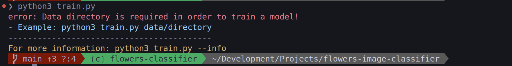

Provide the data directory path when running the script:
```bash
python train.py <data_directory_name>
```
You'll be greeted with a welcome message and configuration menu:
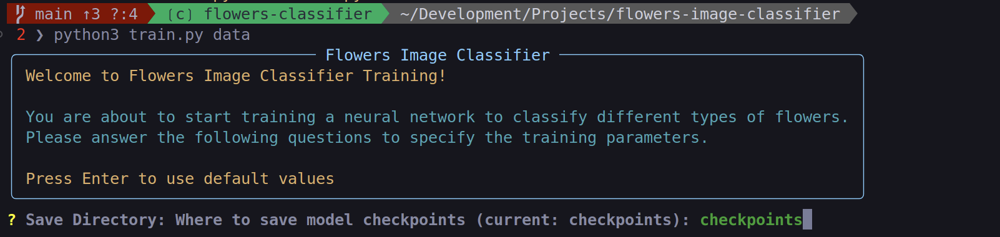

Navigate through the parameter configuration menu, using [Enter] to accept defaults:


For detailed parameter information, use:
```bash
python train.py --info
```
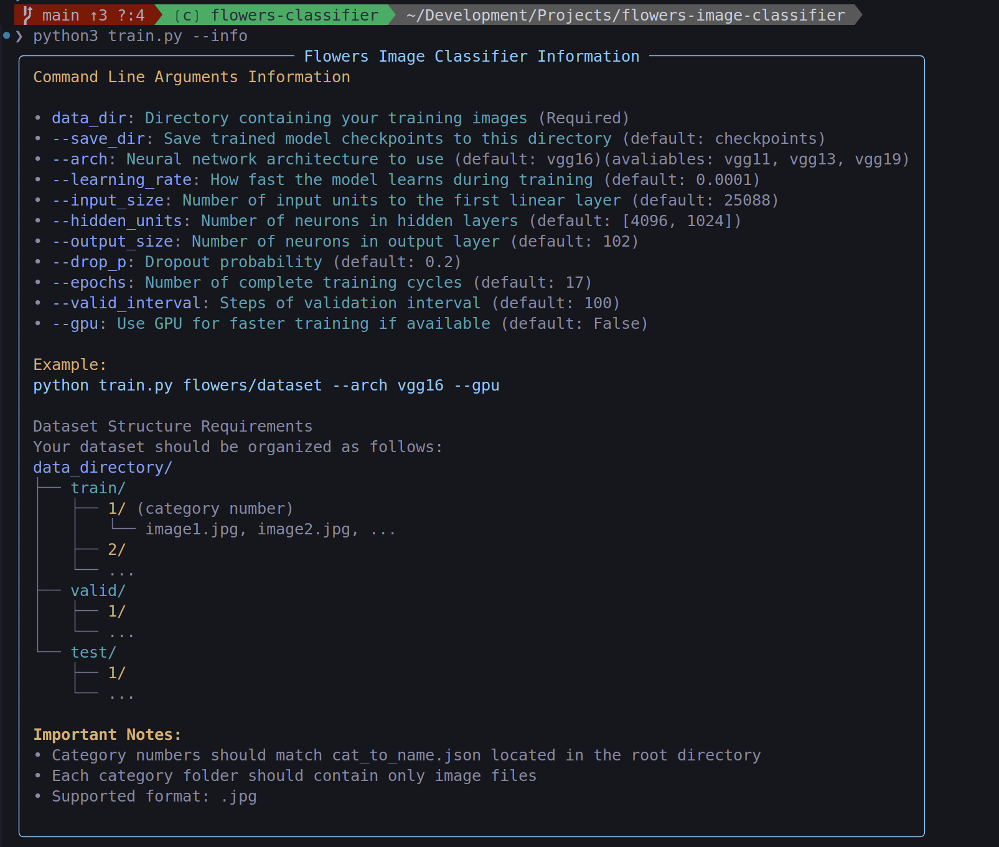

### 2. Dataset Management
After configuration, the system sets up your dataset directory:


You'll receive information about the dataset requirements:
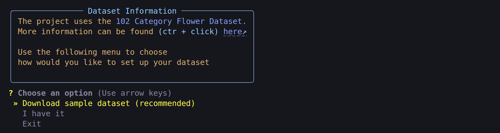

Download the dataset when prompted:


The system automatically extracts and validates the dataset:
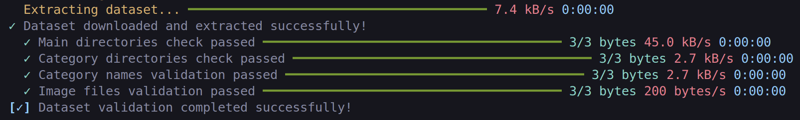

Review the preprocessing steps before continuing:
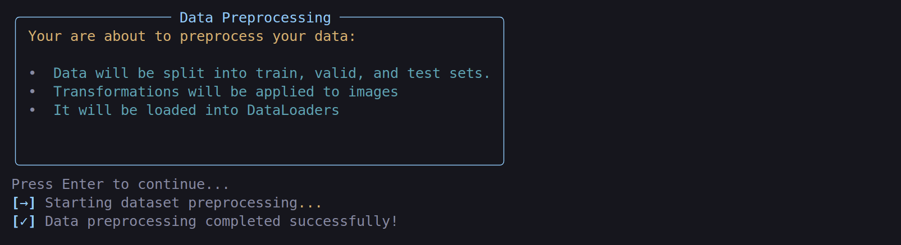

### 3. Model Configuration
The preprocessing phase begins with device setup and model initialization:
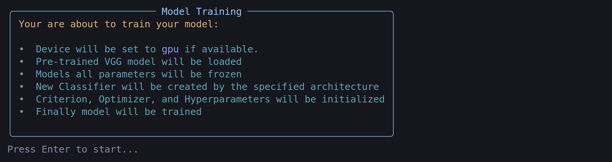

The system configures CUDA if available and loads your chosen VGG model:
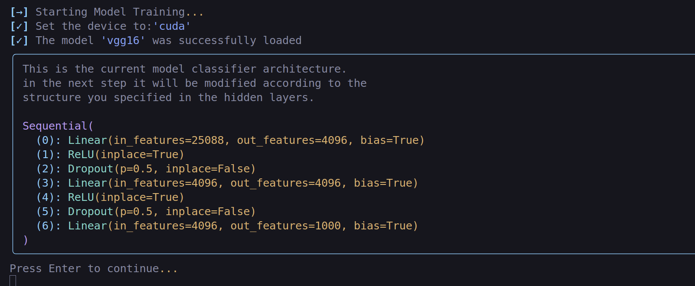

The classifier architecture is updated based on your specifications:
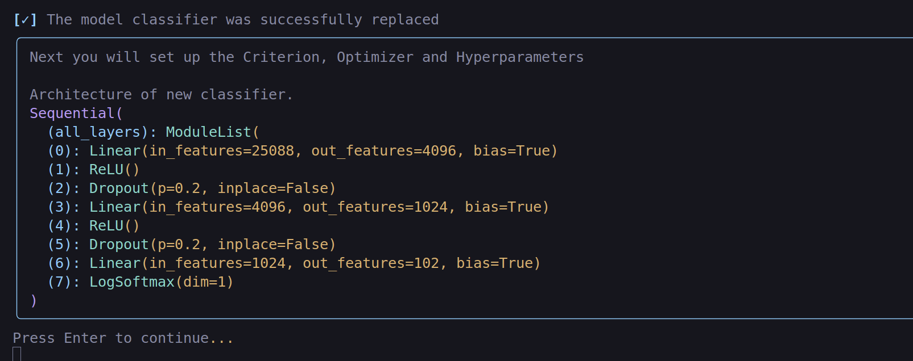

### 4. Training Process
Review the pre-training summary:
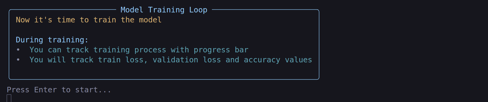

During training, you'll see real-time metrics including training loss, validation loss, and accuracy:
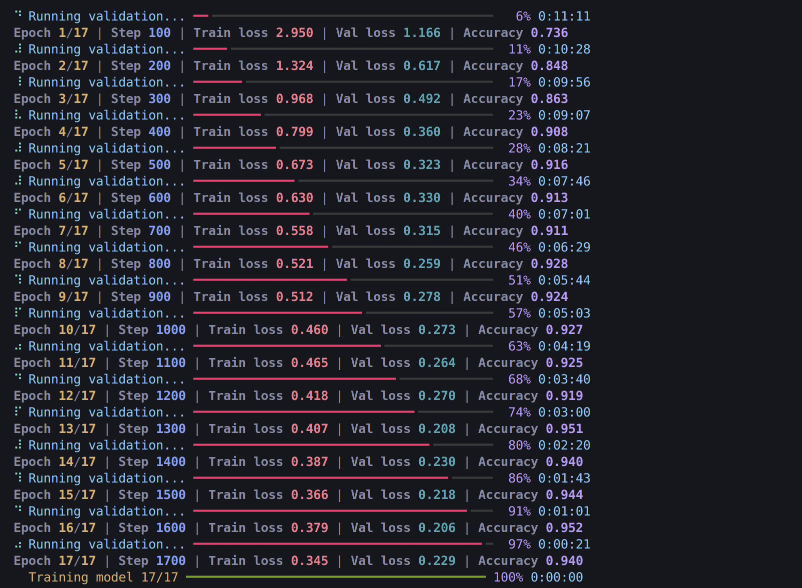

### 5. Model Evaluation
After training completes, the system evaluates the model and presents options to save, retrain, or exit:
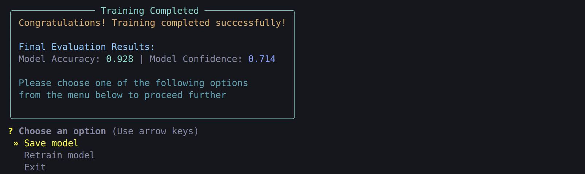

## Prediction Workflow

### 1. Model Loading
Start predictions either through the menu or command:
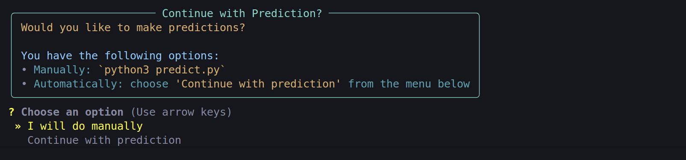

Select your trained model checkpoint (default location is `checkpoints` directory):
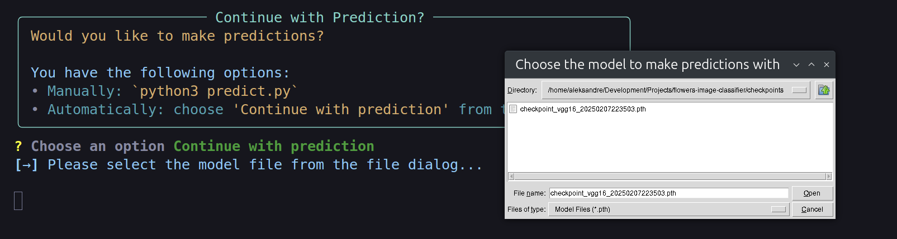

The system loads and displays the model architecture:
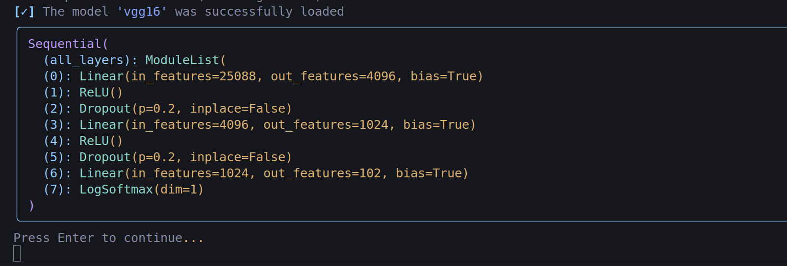

### 2. Image Processing
Select an image for classification:
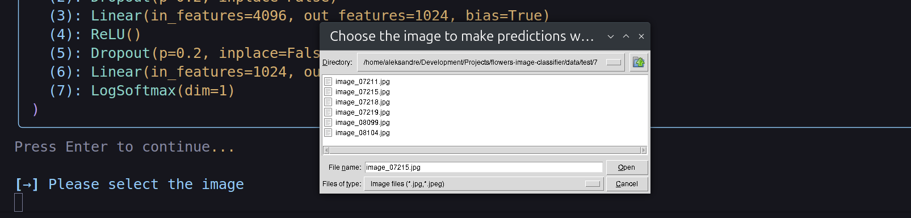

Choose the category-to-name mapping file (required for first-time use):
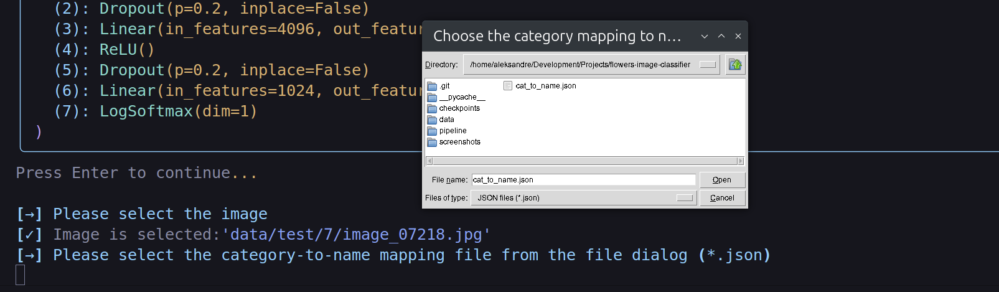

Configure prediction parameters (top-k and GPU options):
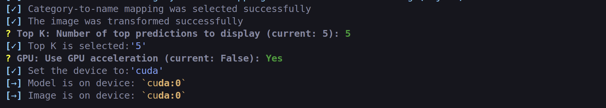

### 3. Making Predictions
View prediction results and choose to continue with more predictions or exit:
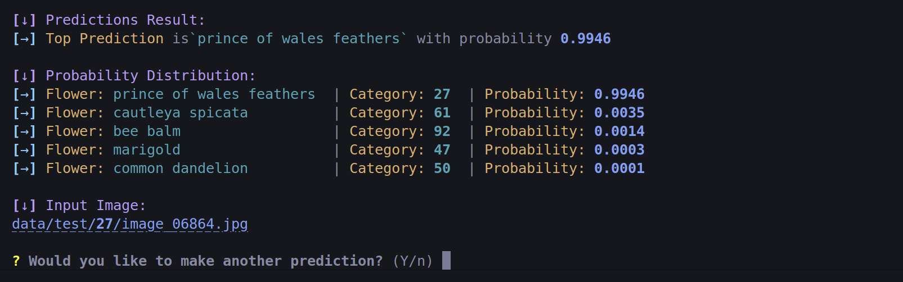