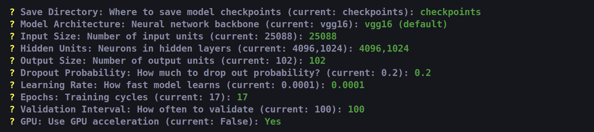
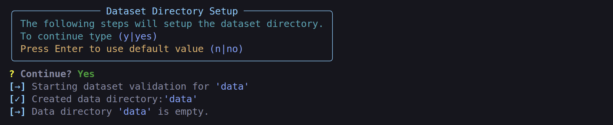

# Flower Image Classifier

## Project Overview
This project implements a sophisticated deep learning model for classifying different species of flowers. Using neural network architectures, the classifier can identify various flower species from images with high accuracy.


## Features
- Interactive and command-line interfaces
- Multiple pre-trained model architectures (VGG11, VGG13, VGG16, VGG19)
- Automated dataset downloading and validation
- Comprehensive data preprocessing with augmentation
- Real-time training progress monitoring
- Model checkpoint management
- Top-k predictions with probability scores

## Project Structure
```
├── train.py           # Main training script
├── predict.py         # Main prediction script
├── pipeline/
│   ├── landing.py         # Training parameter configuration
│   ├── process_data.py    # Dataset validation and setup
│   ├── preprocess_data.py # Data transformation and loading
│   ├── train_model.py     # Model training implementation
│   ├── load_model.py      # Model loading for prediction
│   └── make_prediction.py # Prediction implementation
└── utils.py          # Utility functions and helpers
```

## Installation

### Prerequisites
- [Anaconda](https://www.anaconda.com/products/distribution) or [Miniconda](https://docs.conda.io/en/latest/miniconda.html)

### Setup Steps
1. Clone the repository:
```bash
git clone https://github.com/Aleksandre19/udacity-aip-flowers-image-classifier.git
cd flowers-image-classifier
```

2. Create and activate Conda environment:
```bash
# Create new environment
conda create -n flowers-classifier python=3.8

# Activate the environment
conda activate flowers-classifier
```

3. Install dependencies from environment.yml:
```bash
conda env update -f environment.yml
```

4. Verify installation:
```bash
python -c "import torch; print(f'PyTorch version: {torch.__version__}')"
```

## Usage Guide

### 1. Training the Model
Only running the following command will get error because the data directory is required:
```bash
python train.py
```


The data directory represents the folder where your data will live and you can specify it when running the training script:
```bash
python train.py <data_directory_name>
```
After which you get a welcome message with a configuration menu.


Simply follow the instruction and specify parameters or choose defaults by pressing [Enter].


If you want to know more about the parameters, you can run the following command:
```bash
python train.py --info
```
It also provides a info about the dataset structure.


After specifying the configuration, the dataset directory will be set up in case you choose to continue.


The training workflow includes:

#### a. Dataset Setup
- Validates data directory structure
- Downloads sample dataset if needed
- Ensures proper train/valid/test split organization

#### b. Data Preprocessing
- Applies data augmentation for training (rotation, crop, flip)
- Normalizes images using ImageNet statistics
- Creates efficient data loaders with memory pinning

#### c. Model Configuration
Customize your model through the interactive menu:
- Architecture: Choose from VGG11, VGG13, VGG16, VGG19
- Input size: Configure input layer dimensions
- Hidden units: Specify hidden layer architecture
- Learning rate: Set training optimization rate
- Epochs: Define training duration
- GPU usage: Enable/disable CUDA acceleration

<screenshot>
[Screenshot showing the training progress with loss and accuracy metrics]

### 2. Making Predictions
Use the trained model for predictions:
```bash
python predict.py --model <path_to_checkpoint>
```

<screenshot>
[Screenshot showing the prediction interface and results]

The prediction workflow includes:
- Model checkpoint loading
- Interactive image selection
- Category-to-name mapping configuration
- Top-k predictions with probability scores

## Dataset Structure
The dataset should be organized as follows:
```
data_directory/
    ├── train/
    │   ├── class_1/
    │   ├── class_2/
    │   └── ...
    ├── valid/
    │   ├── class_1/
    │   ├── class_2/
    │   └── ...
    └── test/
        ├── class_1/
        ├── class_2/
        └── ...
```

## Model Checkpoints
Checkpoints are saved during training and contain:
- Model state dictionary
- Optimizer state
- Class-to-index mapping
- Model architecture configuration

## Performance Tips
- Use GPU acceleration for faster training
- Adjust batch size based on available memory
- Enable memory pinning for improved data loading
- Start with default hyperparameters and tune as needed
